# SafeStride Strava Signup Flow - Visual Architecture

## 🎯 Complete System Architecture

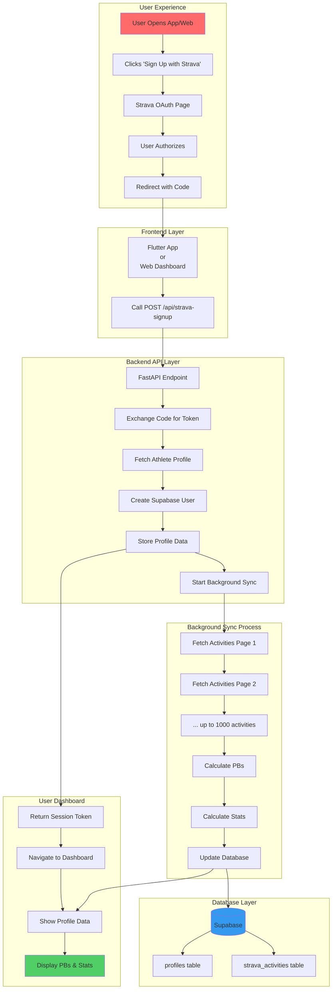

## 📊 Data Flow Diagram

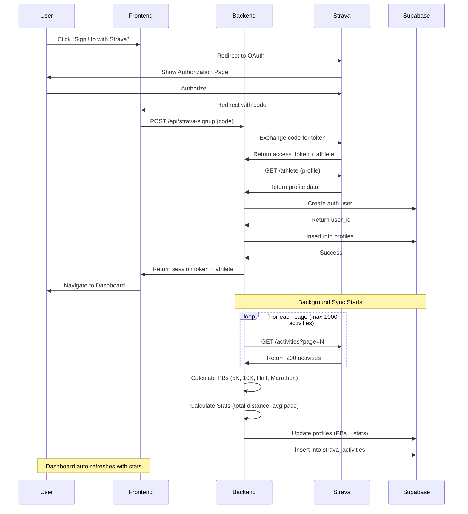

## 🗂️ Database Schema Diagram

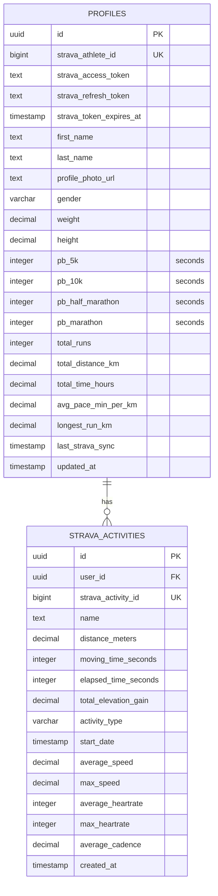

## 🔄 Personal Best Calculation Logic

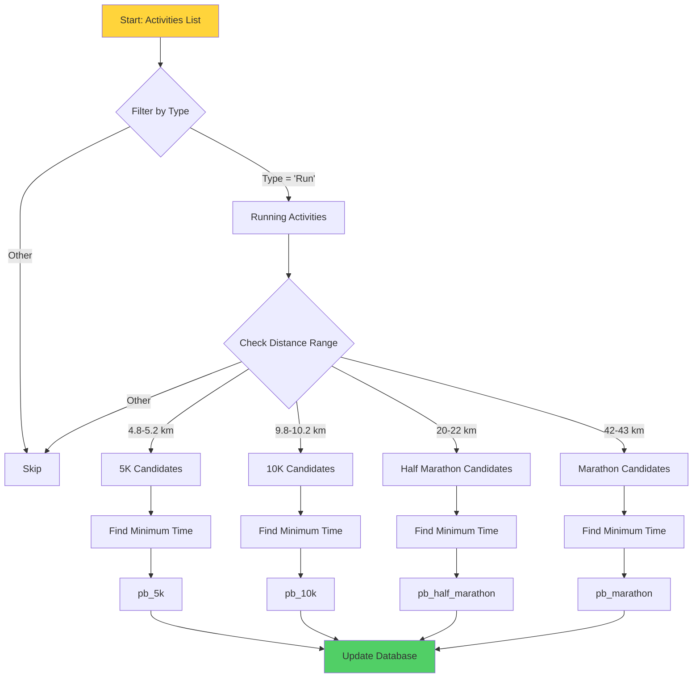

## 🚀 Deployment Architecture

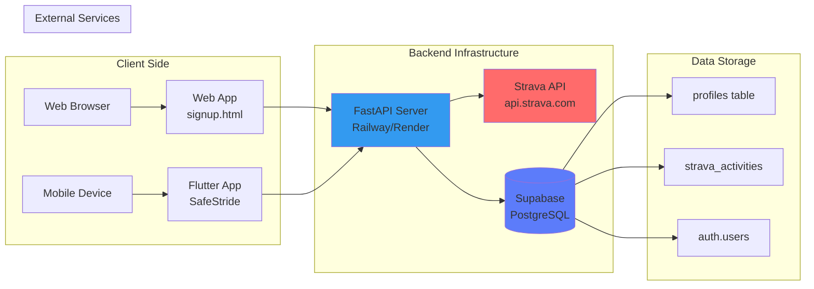

## 📱 Mobile App Component Hierarchy

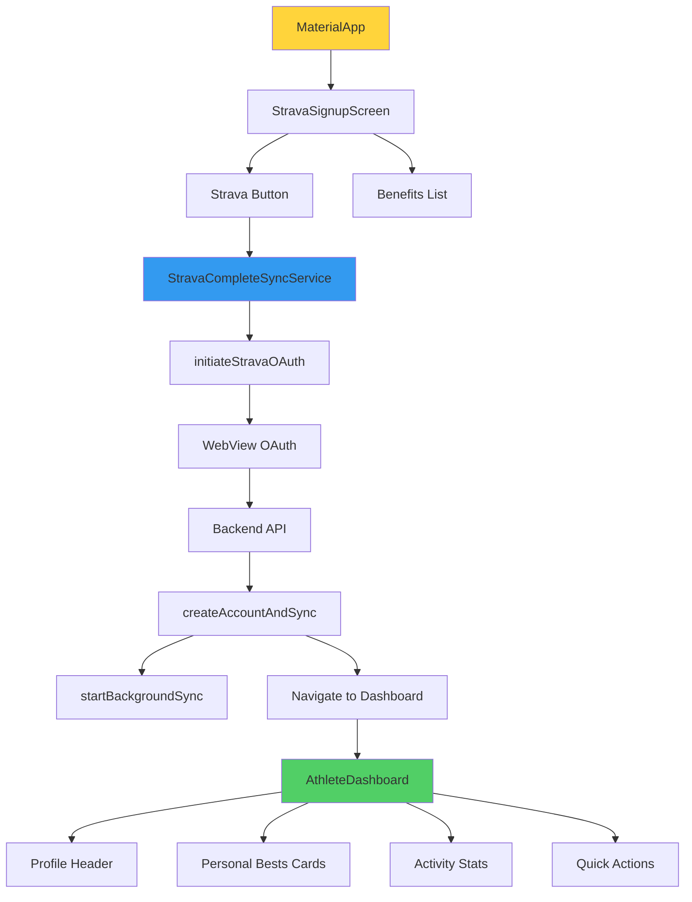

## 🌐 Web Dashboard Flow

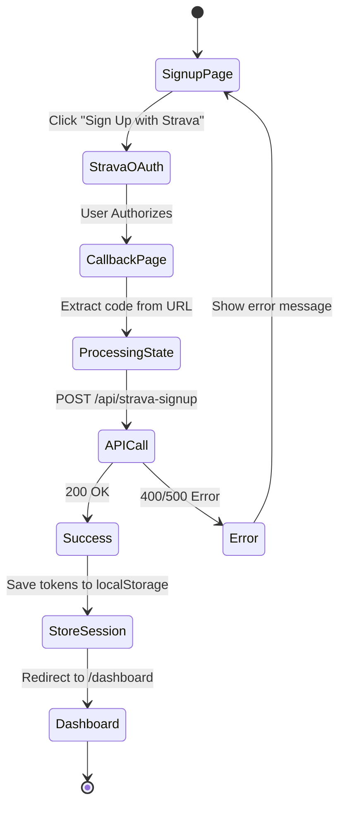

## 🔐 Security Flow

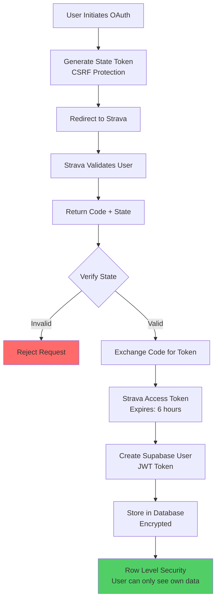

## 📈 Performance Optimization

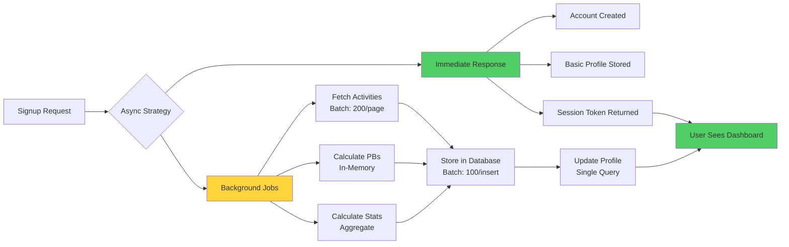

## 📊 Activity Sync Progress States

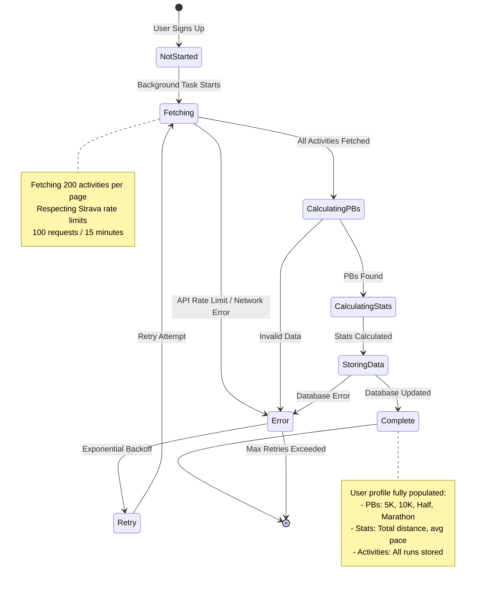

## 🎨 UI Component Tree

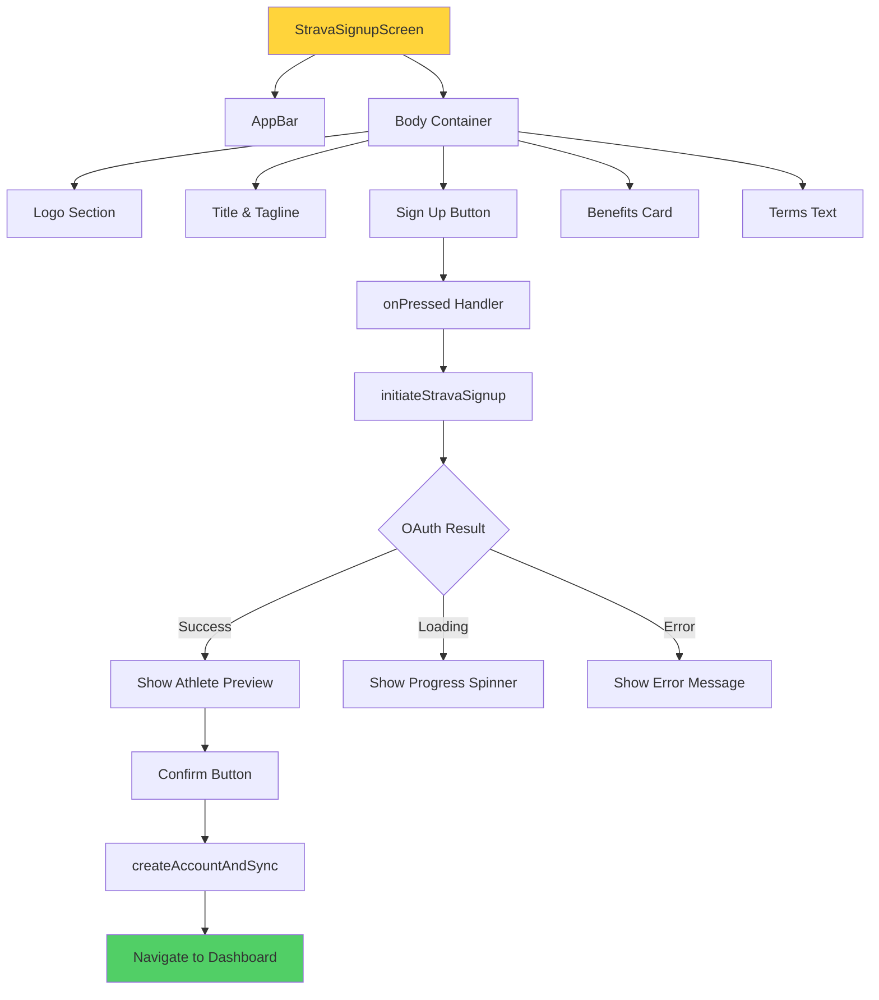

## 🔄 Token Refresh Flow

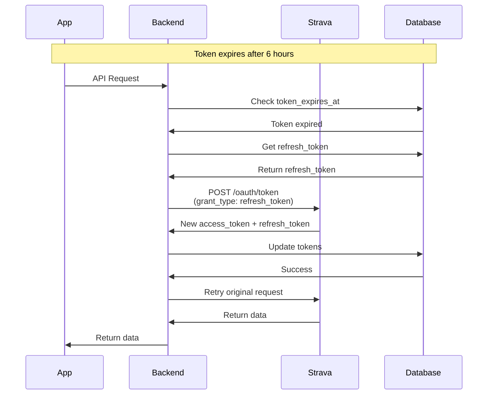

## 📝 Summary

### Key Features:

- ✅ One-click signup with Strava OAuth
- ✅ Auto-population of profile data
- ✅ Automatic PB calculation (5K, 10K, Half, Marathon)
- ✅ Background sync of up to 1000 activities
- ✅ Real-time dashboard updates
- ✅ Secure token management
- ✅ Row-level security on data

### Technology Stack:

- **Frontend**: Flutter (mobile) + HTML/JS (web)
- **Backend**: FastAPI (Python)
- **Database**: Supabase (PostgreSQL)
- **OAuth**: Strava OAuth 2.0
- **Real-time**: Supabase Realtime subscriptions

### Performance:

- **Signup Time**: < 2 seconds (before background sync)
- **Background Sync**: 30 seconds - 5 minutes (depending on activity count)
- **Database**: Optimized with indexes on frequently queried fields
- **API**: Rate limit respecting (100 requests / 15 minutes)

---

**Ready to deploy!** 🚀
